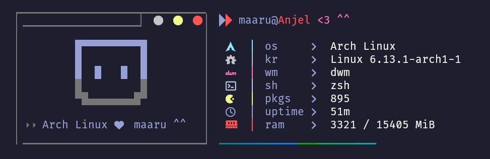

# System Fetch Script

## 📌 Description

This Python script displays beautiful system information in the terminal using ANSI colors and icons.

## 🎨 Example Output



## 🚀 Installation and Usage

### Install via `yay`

1. Install the package using `yay`:
   ```sh
   yay -S mfetch
   ```
2. Run the script:
   ```sh
   ./mfetch
   ```

### Install via Git

1. Clone the repository:
   ```sh
   git clone https://github.com/maarutan/maarufetch.git
   cd maarufetch
   ```
2. Make the script executable:
   ```sh
   chmod +x mfetch
   ```
3. Run the script:
   ```sh
   ./mfetch
   ```

---

if u want usage of default

1. move script to /usr/bin
   ```sh
   sudo cp ./mfetch /usr/bin/
   mfetch
   ```

## 📜 Dependencies

- Python 3
  or other ...

## 🛠 Possible Improvements

- Add support for other Linux distributions.
- Implement a configuration file for customizing colors and icons.

## 📄 License

This project is licensed under the MIT License.
